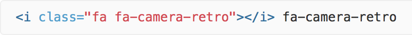
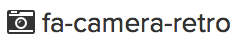
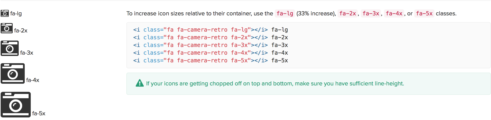
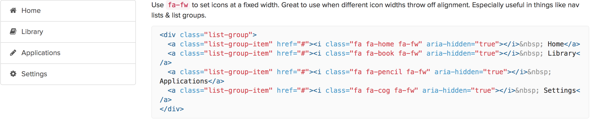
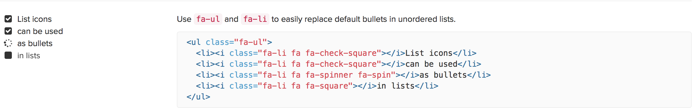
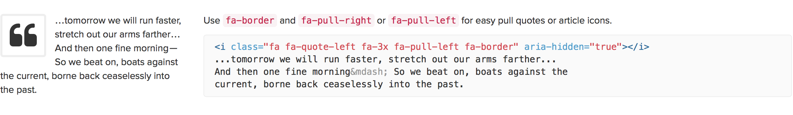
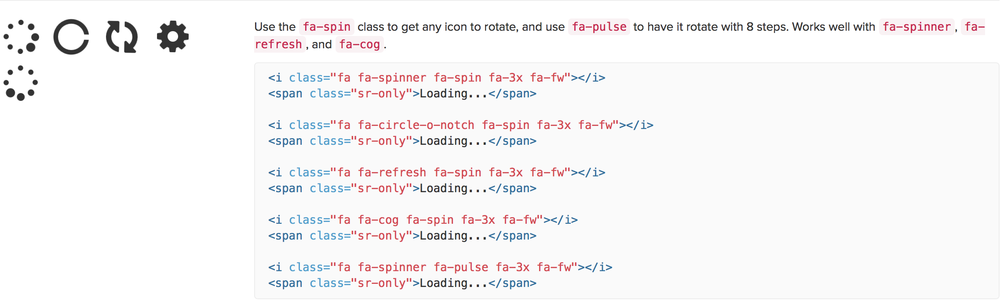
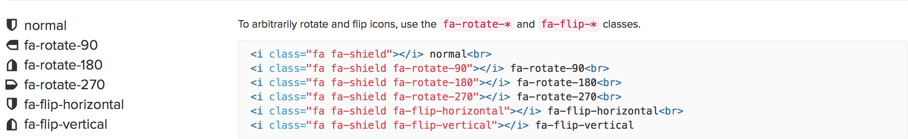
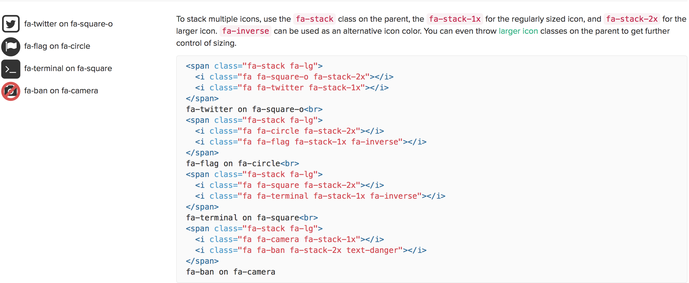

#Font Awesome 

> "It makes it easy to add vector icons and social logos to your website."

###The easiest way to get started! 

Put your e-mail and Font Awesome CDN will send you a code to paste it in your HTML document.  

###How to use it?  

You can place the icons anywhere using the CSS Prefix "fa" and the icon's name. This is how it looks like: 
 

This is what you'll get:  

How to change the size of the icon: 

 

How to fix the width of the icons: 

How to make list icons: 

 

How to make bordered and pulled icons: 

How to make animated icons: 

 

How to rotate icons: 

 

How to stack icons: 

 

